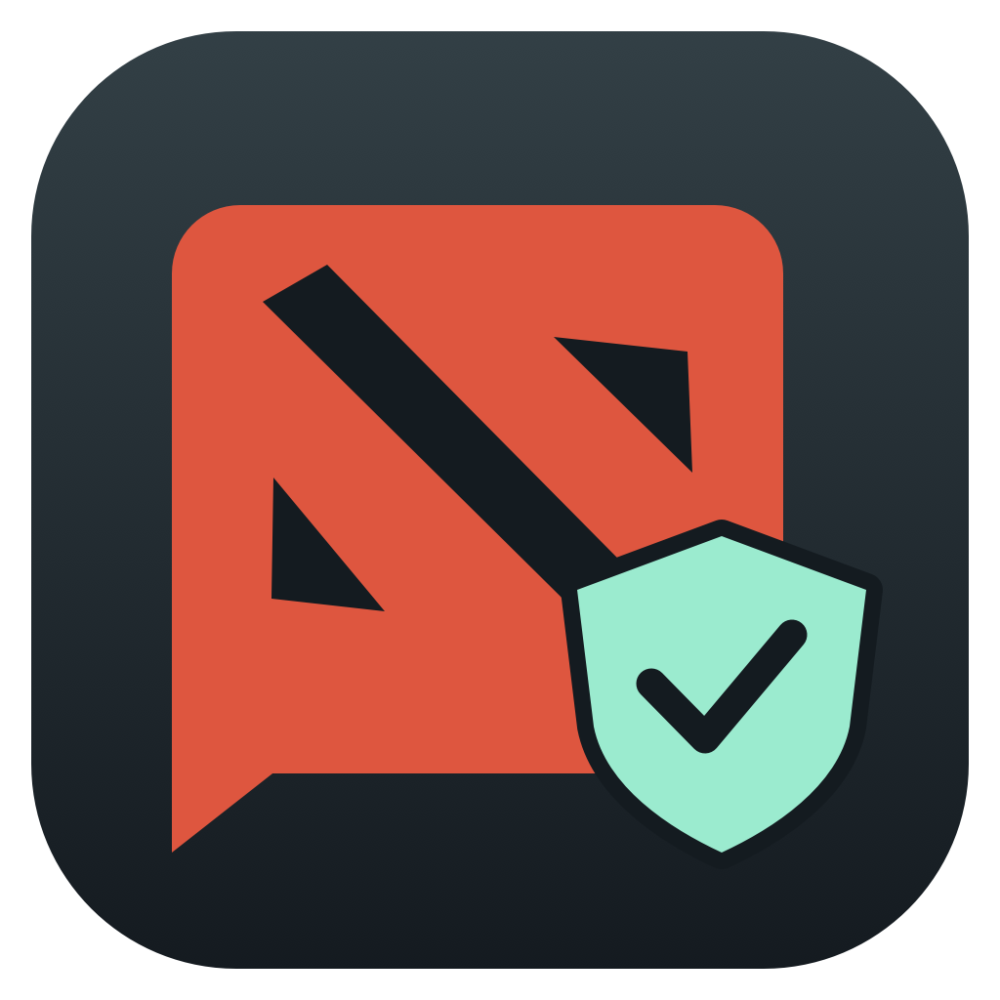

# Dota Tilt Guard



A small native macOS app that helps you pause before sending abuse in Dota 2. Formerly Calm Chat. Russian and English interface, with a language switch that remembers your choice.

[Справка на русском](README.ru.md) · [Download the DMG](https://github.com/zemelko/calm-chat/releases/latest)

## Install

1. Open the DMG and drag **Dota Tilt Guard.app** into **Applications**.
2. Eject the disk image and launch the app from Applications. Quit any older Calm Chat / Dota Tilt Guard instance first.
3. For text protection, allow the app in **System Settings → Privacy & Security → Accessibility**. Enable protection, return to Dota and press Esc before opening chat with Enter.
4. For voice protection, open **Component setup** using the gear button. Install **BlackHole 2ch** from the official link and restart the Mac, then download your speech language through macOS if needed. Choose your physical microphone and that language in the Voice tab, and allow Microphone access.
5. In Dota, use the system microphone or BlackHole 2ch. Enable voice protection before speaking.

The current binary is for **Apple Silicon**. Text protection requires **macOS 13+**; voice protection requires **macOS 26+**, a microphone, BlackHole 2ch and local Apple dictation assets. Dota 2 is installed separately through Steam. Python, Homebrew, Node.js, API keys and third-party AI runtimes are not required.

The DMG contains the app, installation instructions and official dependency links. BlackHole and Apple's language assets are **not bundled**. The first voice setup needs an internet connection; filtering and speech recognition run locally afterward. Language downloads fetch assets from Apple and do not send audio or chat text. No audio recordings, analytics or message history are stored.

This is an **ad-hoc signed, non-notarized development build**. A downloaded copy may be blocked by Gatekeeper. If you trust this release, use macOS's per-app **Privacy & Security → Open Anyway** workflow. No system-wide security changes are needed. After an update, macOS may require removing the old Accessibility entry and adding the current app from Applications again.

## What it does

Text protection watches keyboard input only in the Dota process. A local Russian/English dictionary checks the tracked draft before Enter sends it. Known abuse blocks sending. Typing, Backspace and select-all with Command+A / Control+A followed by deletion or replacement are supported. An empty draft can be closed with Enter. Pasting, partial selection, arrow keys, mouse editing or focus changes require Esc and a fresh draft. The pre-game click-to-type chat is not supported.

Voice protection sends the physical microphone to a local Apple recognizer and separately to BlackHole. Detecting abuse clears queued outgoing audio and sends silence for three seconds. New abuse extends the pause while recognition continues listening. The first word can escape before recognition. There is no intonation detection, and dictionary coverage is incomplete in both modes.

The voice filter applies to apps using the system input. A different microphone explicitly selected in another app bypasses it. Stopping protection or quitting normally restores the previous system input. After a crash, select your physical microphone in macOS Sound settings if BlackHole remains selected. Audio and recognition failures mute the outgoing stream until restart.

The app does not edit Dota files or game memory, inject code, or automate gameplay. This is an independent project, not affiliated with or endorsed by Valve. Dota 2 belongs to Valve. No anti-cheat compatibility guarantee is made.

## Build and test

Requires Apple Command Line Tools with a macOS 26+ SDK. No third-party Swift packages. Quit the app before replacing a build.

```sh
./scripts/test.sh '/absolute/path/checks'
./scripts/build.sh '/absolute/path/Dota Tilt Guard.app' '/absolute/path/build'
./scripts/dmg.sh '/absolute/path/Dota Tilt Guard.app' '/absolute/path/output' '/absolute/path/work'
./scripts/archive-release.sh '/absolute/path/Dota Tilt Guard.app' '/absolute/path/releases'
```

The build signs a clean staged bundle before replacing the destination. Release archives contain the app, source snapshot and checksums; existing versions cannot be overwritten. Version 0.5.0 uses its own bundle identifier, `com.zemelko.dotatiltguard`, so macOS permissions appear under Dota Tilt Guard instead of Calm Chat. Grant permissions to the new app from Applications and remove old Calm Chat entries. Run only one version at a time.

Automated checks cover filtering, tracked input, select-all deletion, voice cooldown and repeated hypotheses; PCM silence, queue clearing, fresh audio and channel conversion; and localization templates. Live microphone transcription and BlackHole mute/resume were checked during 0.4.0 development. A particular Dota session's selected input still needs an in-game check.

## Dependencies and rights

| Component | Distribution | Purpose |
| --- | --- | --- |
| Swift runtime, AppKit, SwiftUI, CoreAudio, AVFoundation, Speech | macOS | Interface, input, audio and local recognition |
| [BlackHole 2ch](https://github.com/ExistentialAudio/BlackHole) | Separate official installer | Virtual microphone for voice protection |
| Apple dictation assets | Downloaded by macOS on request | Local Russian / English recognition |
| Dota 2 | Separate Steam installation | Target game |

BlackHole has its own GPL-3.0 terms and is not included in this repository or app. Its authors request separate licensing for non-GPL integrations. The app accesses the installed audio device through CoreAudio; it contains no BlackHole code.

This repository is public for inspection, **not released under MIT or another open-source license**. See [COPYRIGHT.md](COPYRIGHT.md). Third-party rights are unchanged.

## Version 0.5.1

- Added a small Dota-and-shield menu bar icon matching the app branding.

## Version 0.5.0

- Renamed to Dota Tilt Guard with a chat-and-shield icon.
- Added persistent Russian / English interface switching, including menus and status messages.
- Added component setup with BlackHole links and explicit Apple language downloads.
- Retained the text filter and voice mute behavior from 0.4.0.
